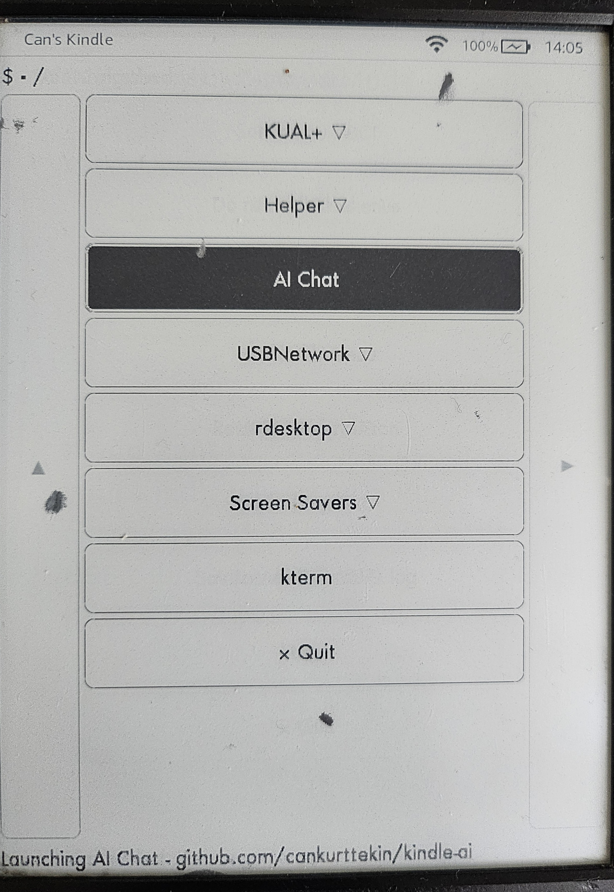

# kindle-ai

This project provides an AI chat interface for Kindle devices, leveraging the Gemini AI API. It allows users to interact with an AI, optionally using their book highlights/clippings as context.

## Installation and Setup

1.  **Copy `aichat` directory:** Copy the `aichat` directory to the `extensions/` directory on your Kindle. The path on Kindle will be `/mnt/us/extensions/aichat`.
2.  **Install `kterm` and Python:** Ensure that `kterm` and a compatible Python version (3.9 is specified in the shell script) are installed on your Kindle. You can find relevant links in the `aichat/CREDITS` file:
    *   `kterm` - [https://www.fabiszewski.net/kindle-terminal/](https://www.fabiszewski.net/kindle-terminal/)
    *   Kindle Python installer - [https://github.com/NiLuJe](https://github.com/NiLuJe)
3.  **Set Gemini API Key:**  An API key for the Gemini AI service is required.

## How to Run

1.  **Using KUAL:** If you have KUAL installed, there will be a `AI Chat` option. KUAL can be installed from the link in `aichat/CREDITS`. [https://bitbucket.org/ixtab/kindlelauncher/src/master/](https://bitbucket.org/ixtab/kindlelauncher/src/master/)
2.  **Manual execution:** Alternatively, you can run `aichat.sh` via `kterm`, or launch the Python script directly via  `kterm`. Example:
   ```bash
   /mnt/us/extensions/kterm/bin/kterm -e "python3.9 /mnt/us/extensions/aichat/bin/geminikindle.py"
   ```
    *   The script uses `aichat.sh` to launch `kterm` and then runs the `geminikindle.py` python script. The script `aichat.sh` also sets up environment variables like `TERM` and selects a suitable keyboard layout based on the device's DPI.

3.  **Interactive Prompt:** Once the script is running, you will be prompted for a question.
4.  **Clipping Selection:** If clippings are found on your device, you will be prompted to select which ones to include in the context of your question.
5.  **AI Response:** The script then sends the prompt to the Gemini API and displays the formatted response.

## Screenshots




## License

This project is licensed under the [GNU General Public License v3](LICENSE).

